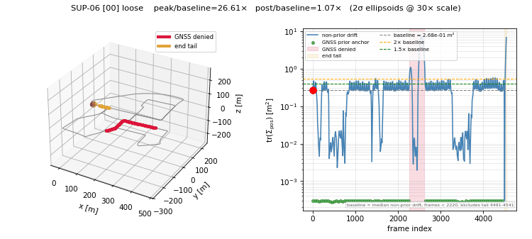
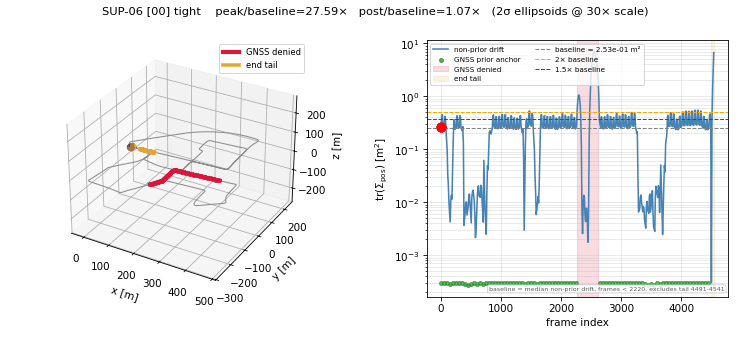

# LiDAR-Inertial SLAM & HD Map Pipeline

> A production-grade LiDAR-inertial SLAM and HD Map feature extraction pipeline on KITTI/nuScenes — with EKF sensor fusion, Scan Context loop closure, and Lanelet2 export.

[](https://github.com/trouties/lidar-slam-hdmap/actions)


## Pipeline Architecture

```
 Stage 1              Stage 2            Stage 3               Stage 4
 Data Ingestion       LiDAR Odometry     Graph Optimization    Sensor Fusion
┌──────────────┐    ┌───────────────┐   ┌──────────────────┐  ┌─────────────────┐
│ KITTIDataset │    │   KISS-ICP    │   │  GTSAM Pose Graph│  │ Error-State KF  │
│ NuScenesDset │───>│  adaptive ICP │──>│+ Scan Context v2 │─>│+ GTSAM tight    │
│              │    │               │   │+ IMU Preintegr.  │  │  coupling       │
└──────────────┘    └───────────────┘   └──────────────────┘  └────────┬────────┘
  (N,4) point         SE(3) 4x4            optimized SE(3)            │
  clouds              odometry poses       poses                      │
                                                                      v
                     Stage 6              Stage 5              fused poses
                     HD Map Export        Mapping              + point clouds
                    ┌───────────────┐   ┌──────────────────┐         │
                    │ Lanelet2 .osm │<──│ Voxel Map Builder│<────────┘
                    │ + GeoJSON     │   │+ Lane/Curb Extr. │
                    └───────────────┘   └──────────────────┘
                      regulatory HD       PCA-classified
                      map output          lane/curb clusters
```

## Results

### System Accuracy Comparison

Evaluated with [evo](https://github.com/MichaelGrupp/evo) APE (Absolute Pose Error). Lower is better.

| System | Seq 00 APE RMSE (m) | Seq 00 APE Mean (m) | Seq 05 APE RMSE (m) | Seq 05 APE Mean (m) |
|--------|---------------------:|--------------------:|---------------------:|--------------------:|
| **Ours (fused)** | **11.53** | **10.22** | **3.23** | **2.80** |
| hdl_graph_slam | 78.46 | 68.05 | 56.48 | 33.97 |
| FAST-LIO2 | 77.41 | 61.32 | 20.69 | 15.56 |
| LIO-SAM | 552.85 | 506.00 | 968.82 | 891.86 |

> Baselines run in Docker containers on identical KITTI sequences. See [`external/`](external/) for reproduction scripts.

<!-- INSERT: results/trajectory_comparison_seq00.png -->

### Stage-by-Stage Accuracy Improvement (Seq 00)

| Pipeline Configuration | APE RMSE (m) | Delta |
|------------------------|-------------:|------:|
| Stage 2: KISS-ICP odometry only | 12.53 | baseline |
| Stage 3: + pose graph + Scan Context loop closure | 11.53 | −8.0% |
| Stage 3†: + IMU tight coupling (GTSAM preintegration) | 9.22 | −20.0% vs loose |
| Stage 4: + ESKF fusion | 11.53 | <0.01 m ‡ |

> † Uses KITTI Raw OxTS data via SUP-04 tight coupling path (Forster 2017 IJRR preintegration factor).
>
> ‡ KITTI Odometry contains no IMU data — ESKF uses a constant-velocity model and cannot improve already-optimized poses. Full ESKF value appears on datasets with raw IMU (nuScenes, KITTI Raw).

<!-- INSERT: results/trajectory_seq00_optimized.png -->

### Performance

| Metric | Value |
|--------|------:|
| Stage 2 per-frame latency p50 | 145 ms |
| Stage 2 per-frame latency p95 | 204 ms |
| Full pipeline (200 frames, Seq 00) | 50.6 s |
| Loop closures detected (Seq 00 full) | 2,635 |
| Loop closure precision | 0.967 |
| Loop closure recall | 0.195 |
| Stage 3 speedup (production config, SUP-03 round 2) | 2.19× (2866 s → 1311 s, Seq 00) |
| Stage 3 ICP verify speedup (downsample cache) | 3.36× (p50 255 ms → 77 ms) |
| GNSS denial drift (Seq 00, 150 m window) | 0.003 m/m |

### Cross-Dataset Validation (nuScenes)

All 10 nuScenes mini scenes pass the APE < 10 m acceptance threshold.

| Scene | Frames | Stage 2 APE Mean (m) | Stage 3 APE Mean (m) |
|-------|-------:|---------------------:|---------------------:|
| scene-0553 | 398 | 0.014 | 0.014 |
| scene-0757 | 397 | 0.530 | 0.530 |
| scene-0061 | 382 | 0.698 | 0.698 |
| scene-0103 | 389 | 0.801 | 0.801 |
| scene-0916 | 399 | 0.997 | 0.997 |
| scene-0655 | 396 | 1.908 | 1.908 |
| scene-1094 | 391 | 1.892 | 1.892 |
| scene-0796 | 392 | 2.755 | 2.755 |
| scene-1077 | 400 | 6.730 | 6.730 |
| scene-1100 | 391 | 0.070 | 0.070 |

> KISS-ICP adapted for nuScenes 32-beam VLP-32C: `voxel_size=0.5` (vs KITTI 1.0), `min_range=3.0` (vs 5.0), 20 Hz sweep mode (2 Hz keyframes cause ICP divergence).

<!-- INSERT: results/nuscenes_ape_bar_chart.png -->

### Pose Graph Uncertainty Under GNSS Denial (SUP-06)

Per-keyframe **marginal covariance** is extracted from the GTSAM factor graph after Levenberg-Marquardt optimization (`gtsam.Marginals.jointMarginalCovariance`) and visualized as 3D 2σ confidence ellipsoids along the optimized trajectory. A 354-frame GNSS denial window (frames 2270–2624) in the middle of KITTI Seq 00 forces the optimizer to dead-reckon between distant priors; the position marginal `trace(Σ_pos)` inflates by **>26×** relative to the steady-state drift baseline, then collapses back to ~1.07× as priors resume.

| Mode | drift baseline `trace(Σ_pos)` | denial peak | **peak / baseline** | post / baseline |
|------|------------------------------:|------------:|--------------------:|----------------:|
| Loose (LiDAR + pose graph) | 0.268 m² | 7.131 m² | **26.61×** | 1.07× |
| Tight (+ IMU preintegration, SUP-04) | 0.253 m² | 6.990 m² | **27.59×** | 1.07× |

Both modes pass the SUP-06 acceptance criteria (`peak / baseline ≥ 2×`, `post / baseline ≤ 1.5×`). Tight coupling mildly suppresses the denial peak (7.13 → 6.99 m², ~2%) and the drift baseline (0.268 → 0.253 m², ~6%) — limited by the conservative `accel_noise_sigma=5.0` lock from SUP-04 (FM-5).





> **Left panel**: 3D trajectory with the current keyframe's 2σ position ellipsoid (drawn at 30× visual scale on a 564 m sequence). Crimson segment = GNSS-denied window; gold segment = end-of-sequence boundary effect (last 50 frames lack downstream prior support, excluded from baseline statistics).
>
> **Right panel**: `trace(Σ_pos)` time series — green dots are GNSS-anchored frames pinned at `prior_sigma² ≈ 3 × 10⁻⁴ m²`; the blue line is the non-prior drift signature; horizontal dashed lines mark the drift baseline (median of non-prior drift outside denial + tail), 1.5× and 2× thresholds.
>
> **Baseline definition is non-trivial** — naively averaging all 459 sample frames mixes two populations (prior anchors at ~3 × 10⁻⁴ m² and dead-reckoning drift at ~0.27 m²) that differ by three orders of magnitude. The acceptance metric uses `median(non-prior drift outside [denial − 50, denial + 50] and outside last 50 frames)` to compare like with like.
>
> **Reproduce**: `python -m scripts.run_sup06 --sequence 00 --mode both` (loose ~5 min + tight ~8 min on a Ryzen-5 laptop). Outputs land in [`benchmarks/uncertainty/`](benchmarks/uncertainty/): per-mode CSV with full 3×3 marginals + `is_prior` / `is_tail` / `in_denial` flags, optimized trajectory `.npy`, static PNG with peak ellipsoid annotations, GIF animation, and a JSON acceptance report.

## Why This Matters

**HD Maps are L3+ infrastructure.** Level 3 and above autonomous driving systems depend on centimeter-accurate HD maps for lane-level localization, path planning, and regulatory compliance. This pipeline demonstrates the complete chain from raw LiDAR scans to Lanelet2 — the open standard used by Autoware, Apollo, and European OEMs — covering localization, mapping, and map-layer extraction in a single reproducible workflow.

**Geodesy perspective.** The author's background in geodetic science shapes this pipeline differently from pure robotics approaches. Coordinate reference systems are explicit (WGS84 → UTM via EPSG:32632), the Velodyne-to-camera-to-world transformation chain is rigorously managed through calibration matrices, and GTSAM's Gauss-Newton factor graph optimization is structurally identical to geodetic least-squares network adjustment — a technique geodesists have refined for two centuries.

**Scope.** This is not a perception-only project (3D object detection, lane segmentation). It covers the full localization → mapping → HD map export chain that feeds downstream planning and control modules — the infrastructure layer that most portfolio projects skip.

## Key Features

- **Multi-dataset SLAM** — KITTI Odometry (HDL-64E, 64-beam, 10 Hz) and nuScenes mini (VLP-32C, 32-beam, 20 Hz) with dataset-specific parameter adaptation. Not KITTI-overfit.

- **Scan Context v2 loop closure** — Appearance-based place recognition without GPS prior. 2,635 verified closures on Seq 00 at precision 0.967. ICP fitness gate at 0.9 ensures geometric consistency.

- **Tightly-coupled IMU preintegration** — GTSAM Forster 2017 preintegration factor alongside loosely-coupled ESKF. 20% APE reduction on KITTI Seq 00 (11.53 m → 9.22 m).

- **Lanelet2 HD Map export** — Lane markings (intensity ≥ 0.40) and curb boundaries (height-jump detection) extracted, PCA-classified into thin/thick/area morphology, RDP-simplified (ε = 0.05 m), and exported as Lanelet2 `.osm`.

- **4-system baseline comparison** — Benchmarked against hdl_graph_slam, FAST-LIO2, and LIO-SAM in reproducible Docker containers. Full APE/RPE tables on KITTI Seq 00 and 05.

- **5-layer deterministic cache** — Staged caching (odometry → optimized → fused → master map → features) enables 15-minute Stage 5 iteration cycles versus 2 h 20 min cold runs.

- **Per-frame runtime profiling** — p50/p95/max latency distributions per stage, with Stage 3 `sc_query` / `icp_verify` / `graph_optimize` sub-stage breakdown. Under the production loop-closure config (`sc_query_stride=1`, 2,635 closures on Seq 00), ICP verification is the true bottleneck (76% of Stage 3); a per-frame downsample cache reduces it 3.36× (p50 255 ms → 77 ms) for a **2.19× Stage 3 speedup** with zero APE regression (10.577 m unchanged).

- **GNSS denial resilience** — Drift rate 0.003 m/m over 150 m masked GNSS windows (Seq 00: 0.41 m total drift over 150.3 m denial segment).

- **Pose graph uncertainty visualization** — Per-keyframe marginal covariance extracted from GTSAM (`jointMarginalCovariance`) and rendered as 3D 2σ confidence ellipsoids along the optimized trajectory. A 354-frame GNSS-denial window inflates `trace(Σ_pos)` by **26.6×** (loose) / **27.6×** (tight + IMU) above the steady-state drift baseline, then collapses back within 1.07× as priors resume — both modes pass the SUP-06 acceptance bar.

## Quick Start

### Docker

```bash
# Build and run on KITTI Seq 00
docker build -t slam-pipeline -f docker/Dockerfile .
docker run -v ~/data/kitti:/data/kitti slam-pipeline --config configs/default.yaml
```

<!-- TBD: SUP-09 will add `docker compose up` one-command reproduction with bundled 200-frame subset -->

### Native Installation (WSL2 / Linux)

<details>
<summary>Click to expand native setup instructions</summary>

#### Prerequisites

- Ubuntu 22.04 (native or WSL2)
- Python 3.10

#### 1. Create virtual environment

```bash
python3.10 -m venv ~/slam-env
source ~/slam-env/bin/activate
```

#### 2. Install dependencies

```bash
# numpy MUST be installed first and stay <2.0 (GTSAM binary compatibility)
pip install "numpy>=1.26,<2.0"
pip install -e ".[dev]"
```

#### 3. Install Lanelet2

```bash
# Option A: Official lanelet2 (requires libboost-dev)
pip install lanelet2

# Option B: lanelet2x (pure Python, cross-platform fallback)
pip install lanelet2x
```

#### 4. Download KITTI Odometry

1. Register at [cvlibs.net](https://www.cvlibs.net/datasets/kitti/user_register.php)
2. Download from the [odometry evaluation page](https://www.cvlibs.net/datasets/kitti/eval_odometry.php):
   - **Velodyne laser data** (80 GB uncompressed)
   - **Calibration files** (1 MB)
   - **Ground truth poses** (4 KB, sequences 00–10 only)
3. Extract into `~/data/kitti/odometry/dataset/`:

```
~/data/kitti/odometry/dataset/
├── sequences/
│   ├── 00/
│   │   ├── velodyne/       # .bin point cloud files
│   │   ├── calib.txt
│   │   └── times.txt
│   └── ...
└── poses/
    ├── 00.txt              # ground truth (seq 00–10)
    └── ...
```

> **WSL2 users**: Store data under `~/data/`, **not** `/mnt/c/` — cross-filesystem I/O is 10× slower.

#### 5. Verify and run

```bash
# Verify KITTI data integrity
python scripts/verify_kitti.py --root ~/data/kitti/odometry/dataset --sequence 00

# Run the full pipeline
python scripts/run_pipeline.py --config configs/default.yaml

# Quick test (200 frames, ~2 min)
python scripts/run_pipeline.py --max-frames 200

# Lint and test
ruff check src/ && ruff format --check src/
pytest tests/ -v
```

</details>

## Repository Structure

```
lidar-slam-hdmap/
├── src/
│   ├── data/                # Stage 1 — KITTI, nuScenes, IMU loaders + coordinate transforms
│   ├── odometry/            # Stage 2 — KISS-ICP wrapper with per-frame timing
│   ├── optimization/        # Stage 3 — GTSAM pose graph, Scan Context, loop closure, IMU factor
│   ├── fusion/              # Stage 4 — Error-State Kalman Filter
│   ├── mapping/             # Stage 5 — Streaming voxel map builder + lane/curb feature extraction
│   ├── export/              # Stage 6 — Lanelet2 OSM export with PCA classification
│   ├── visualization/       # Trajectory plots, point cloud rendering, SUP-06 ellipsoid + animation
│   ├── benchmarks/          # Evaluator, timing, GNSS denial, benchmark manifest
│   └── cache/               # 5-layer deterministic cache (odometry → features)
├── scripts/
│   ├── run_pipeline.py      # Main entry point (all 6 stages)
│   ├── benchmark_stage5.py  # 11-sequence Stage 5 iteration benchmarking
│   ├── compare_tight_vs_loose.py  # SUP-04 IMU coupling comparison
│   ├── eval_nuscenes.py     # SUP-05 cross-dataset evaluation
│   ├── run_sup06.py         # SUP-06 uncertainty visualization (GNSS denial)
│   ├── profile_stages.py    # SUP-03 per-frame latency profiling
│   └── run_baseline_compare.py    # SUP-01 4-system comparison
├── tests/                   # 11 test modules (pytest)
├── configs/default.yaml     # All pipeline parameters with tuning rationale
├── benchmarks/              # CSV outputs, runtime profiles, benchmark manifest
├── external/                # Dockerized baselines (LIO-SAM, FAST-LIO2, hdl_graph_slam)
├── docker/Dockerfile
├── .github/workflows/ci.yml # Ruff lint + pytest
└── refs/                    # Specs, pipeline notes, tuning history
```

## Pipeline Details

### Stage 1: Data Ingestion

Loads raw sensor data and produces a unified per-frame interface.

- **Input**: KITTI `.bin` point clouds + `calib.txt` + `times.txt` + `poses/*.txt`; or nuScenes database API (20 Hz sweeps)
- **Output**: `(N, 4) float32` ndarrays `[x, y, z, intensity]` + `4×4 float64` GT poses + `float64` timestamps
- **Key decision**: All processing in Velodyne frame (x-forward, y-left, z-up). Camera frame conversion only at evaluation/export boundary.

### Stage 2: LiDAR Odometry

Per-frame point cloud registration via KISS-ICP adaptive-threshold ICP.

- **Input**: per-frame `(N, 4)` point clouds (reflectance stripped to `(N, 3)` for KISS-ICP)
- **Output**: `List[np.ndarray]` of `4×4` SE(3) odometry poses
- **Key decision**: nuScenes uses `voxel_size=0.5` (vs KITTI `1.0`) and `min_range=3.0` (vs `5.0`) to compensate for 32-beam sparsity.

### Stage 3: Graph Optimization

GTSAM factor graph with three constraint types: odometry, GPS prior, and loop closure.

- **Input**: odometry poses + point clouds (for Scan Context + ICP verification) + optional KITTI Raw OxTS IMU data
- **Output**: globally optimized SE(3) poses
- **Key decision**: `icp_fitness_threshold=0.9` — Scan Context is a coarse recall-oriented filter; ICP at 0.9 is the precision gate. This yields P=0.967 at R=0.195 on Seq 00.

### Stage 4: Sensor Fusion

Dual-path fusion: ESKF (loosely-coupled fallback) and GTSAM tight coupling (when IMU available).

- **Input**: optimized poses + optional IMU measurements
- **Output**: fused SE(3) poses
- **Key decision**: KITTI Odometry has no IMU — ESKF uses constant-velocity model (APE delta < 0.01 m). True fusion value appears with KITTI Raw OxTS or nuScenes IMU. Tight coupling via GTSAM preintegration yields −20% APE when IMU is available.

### Stage 5: Mapping & Feature Extraction

Builds a globally consistent point cloud map and extracts road features.

- **Input**: fused poses + per-frame point clouds (cached master map at `voxel_size=0.10`)
- **Output**: lane clusters + curb clusters (GeoJSON) + global map (`.pcd`)
- **Key decision**: numpy-native streaming voxel aggregation (not Open3D accumulate) to stay under 4 GB RAM. Lane detection via `intensity ≥ 0.40` + DBSCAN (`eps=0.7`, `min_points=40`). Curb detection via height-jump analysis in 0.30 m grid cells.

### Stage 6: HD Map Export

Converts classified feature clusters to Lanelet2 OSM format.

- **Input**: PCA-classified lane/curb clusters (thin/thick/area morphology)
- **Output**: Lanelet2 `.osm` with LineString ways + Area relations + geometry metadata tags (`length_m`, `thickness_m`, `linearity`)
- **Key decision**: RDP polyline simplification at ε = 0.05 m reduces OSM size by 7%. Separate classification pipelines for lane (3-class) and curb (single class with rescue trim at `trim_k=1.0`).

### Supplement Tasks

**Completed:** 4-system baseline comparison (SUP-01), Scan Context v2 loop closure optimization (SUP-02), runtime profiling and Stage 3 speedup (SUP-03), IMU preintegration tight coupling (SUP-04), nuScenes cross-dataset evaluation (SUP-05), pose graph uncertainty visualization under GNSS denial (SUP-06).

**Planned:** degeneracy detection, ROS2 node wrapping, Docker Compose one-command demo, Lanelet2 routing graph, iSAM2 fixed-lag smoother comparison, interactive web demo, and HD map semantic layer extension.

## Benchmark Report

Every benchmark run is tracked in [`benchmarks/benchmark_manifest.json`](benchmarks/benchmark_manifest.json) with fields: `run_id`, `git_sha`, `config_hash`, `timestamp`, `label`, and artifact paths.

Key data files:

| File | Content |
|------|---------|
| [`benchmarks/accuracy_table.csv`](benchmarks/accuracy_table.csv) | APE/RPE across 4 systems × 2 sequences |
| [`benchmarks/nuscenes_ape.csv`](benchmarks/nuscenes_ape.csv) | nuScenes 10-scene cross-dataset results |
| [`benchmarks/tight_vs_loose/ape_compare.csv`](benchmarks/tight_vs_loose/ape_compare.csv) | IMU tight vs loose coupling comparison |
| [`benchmarks/robustness_gnss_denied.csv`](benchmarks/robustness_gnss_denied.csv) | GNSS denial drift measurements |
| [`benchmarks/runtime_profile_baseline_200f.csv`](benchmarks/runtime_profile_baseline_200f.csv) | Per-stage latency profile (200 frames) |
| [`benchmarks/uncertainty/sup06_report_00.json`](benchmarks/uncertainty/sup06_report_00.json) | SUP-06 marginal covariance acceptance metrics (loose + tight) |
| [`benchmarks/uncertainty/marginal_cov_00_loose.csv`](benchmarks/uncertainty/marginal_cov_00_loose.csv) | Per-keyframe 3×3 position marginals + bucket flags (459 rows) |

## Datasets

| Dataset | Sensor | Sequences | Frames | Purpose |
|---------|--------|-----------|-------:|---------|
| [KITTI Odometry](https://www.cvlibs.net/datasets/kitti/eval_odometry.php) | HDL-64E (64-beam, 10 Hz) | 00–10 (with GT) | 4,541 (Seq 00) | Primary benchmark, all stages |
| [nuScenes mini](https://www.nuscenes.org/nuscenes) | VLP-32C (32-beam, 20 Hz sweeps) | 10 scenes | 382–400/scene | Cross-dataset generalization (SUP-05) |
| [MulRan](https://sites.google.com/view/mulran-pr/) | Ouster OS1-64 | — | — | Planned: multi-session loop closure |

## Tech Stack

| Layer | Component | Role |
|-------|-----------|------|
| **Perception** | [KISS-ICP](https://github.com/PRBonn/kiss-icp) | Adaptive-threshold point-to-point ICP odometry |
| **Perception** | [Open3D](http://www.open3d.org/) | ICP verification, point cloud processing, visualization |
| **Optimization** | [GTSAM 4.2](https://gtsam.org/) | Factor graph, Levenberg-Marquardt, IMU preintegration |
| **Optimization** | Scan Context | Appearance-based loop closure descriptor (self-implemented) |
| **Fusion** | Error-State KF | IMU-less constant-velocity fallback (self-implemented) |
| **Mapping** | NumPy streaming voxel | Memory-safe global map aggregation (<4 GB) |
| **Mapping** | DBSCAN (scikit-learn) | Lane marking + curb boundary clustering |
| **Export** | [Lanelet2](https://github.com/fzi-forschungszentrum-informatik/Lanelet2) | HD Map standard, OSM XML format |
| **Evaluation** | [evo](https://github.com/MichaelGrupp/evo) | APE/RPE trajectory metrics |
| **Infrastructure** | Docker | Reproducible baseline comparison containers |
| **CI** | GitHub Actions | Ruff lint + pytest on every push |

## Known Limitations & Failure Modes

### FM-1: ESKF adds no value on KITTI Odometry

- **Symptom**: Stage 4 APE = Stage 3 APE (delta < 0.01 m)
- **Root cause**: KITTI Odometry has no IMU data. ESKF uses constant-velocity model, which cannot improve already-optimized poses.
- **Status**: By design. Use KITTI Raw or nuScenes for full ESKF evaluation. Tight coupling (SUP-04) demonstrates real IMU benefit (−20% APE).

### FM-2: Loop closure recall capped at ~20%

- **Symptom**: Recall 0.195 despite 2,635 closures at precision 0.967
- **Root cause**: Ground truth defines ~13,050 valid pairs. `max_matches_per_query=5` creates a structural ceiling of ~22%. ICP fitness threshold at 0.9 further prunes.
- **Status**: Dataset-inherent limitation. Increasing `max_matches_per_query` yields diminishing returns with linear ICP cost growth.

### FM-3: Empty lanelet relations

- **Symptom**: Lanelet2 `.osm` contains LineStrings and Areas but no `<relation>` elements for drivable lanes.
- **Root cause**: Curb-driven left/right lane boundary pairing not yet implemented.
- **Status**: P2 task (pipeline-notes §12). Prerequisite for SUP-12 routing graph.

### FM-4: Flat-ground assumption in feature extraction

- **Symptom**: Lane markings and curbs lost on hills or multi-level road structures.
- **Root cause**: `road_z_min/max = [-2.0, -1.5]` is a fixed window relative to Velodyne height (1.73 m). No per-frame terrain adaptation.
- **Status**: P3 task. Requires ground plane estimation per segment.

### FM-5: Conservative IMU noise parameters

- **Symptom**: `accel_noise_sigma=5.0` is ~100× looser than OxTS datasheet values.
- **Root cause**: KITTI OxTS outputs filtered navigation data (not raw IMU). Tighter parameters (σ = 0.3) cause APE to explode to 27.85 m (+154%) due to timestamp alignment approximation and calibration residuals.
- **Status**: Locked. Solving requires precise KITTI Raw timestamp synchronization or a dataset with true raw IMU output.

### FM-6: No traffic sign or signal extraction

- **Symptom**: HD map contains only ground-level features (lane markings, curbs).
- **Root cause**: Stage 5 filters to road-plane z-band only. Vertical structures are excluded by design.
- **Status**: SUP-17 (P2) will add heuristic stop line and crosswalk detection.

<!-- TBD: SUP-10 will add visual evidence (screenshots, trajectory overlays) for each failure mode -->

## License

This project is licensed under the [MIT License](LICENSE).

> **Third-party dependencies** have their own licenses (notably `evo` is GPL-3.0 and baseline systems in `external/` are GPL-2.0). These are runtime dependencies or Docker-isolated — they do not affect the license of this project's source code.

## Acknowledgments

This project builds on excellent open-source work:

- [KISS-ICP](https://github.com/PRBonn/kiss-icp) — Vizzo et al., RAL 2023
- [GTSAM](https://gtsam.org/) — Dellaert & Kaess, Georgia Tech
- [Open3D](http://www.open3d.org/) — Zhou et al., arXiv 2018
- [Lanelet2](https://github.com/fzi-forschungszentrum-informatik/Lanelet2) — Poggenhans et al., IV 2018
- [evo](https://github.com/MichaelGrupp/evo) — Grupp, TUM
- [nuScenes](https://www.nuscenes.org/) — Caesar et al., CVPR 2020
- [Scan Context](https://github.com/irapkaist/scancontext) — Kim & Kim, IROS 2018

